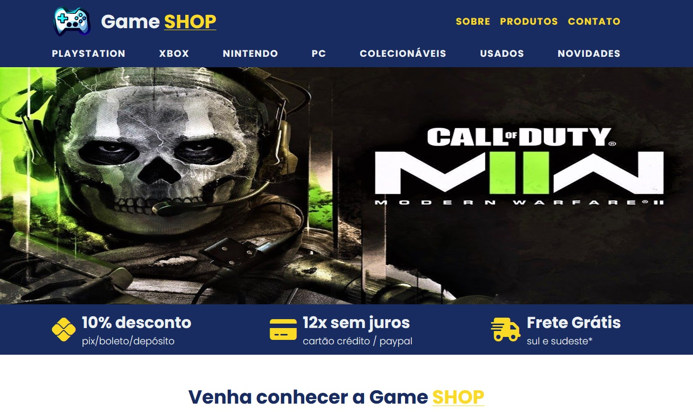

#  Game SHOP

 

## 📎 Sumário
- 📌 Resumo do Projeto
- ⭐ Features
- 📂 Temas abordados
- ✔️ Tecnologias Utilizadas
- 💻 Demonstração
- 🙋🏻‍♂️ Autor

 

## 📌 Resumo do Projeto
Neste site, eu apresento uma página de venda de jogos, criado em HTML e CSS, aplicando conceitos de flex-box e estilos css.

 

## ⭐ Features
- Designe Moderno e elegante;
- Uma seção de sobre da loja;
- Uma seção de produtos com categorias diferentes;
- Uma seção de contatos;

 

## 📂 Temas abordados
- HTML
- CSS
- Formulários
- Listas
- Font Awesome
- vercel

 

## ✔️ Tecnologias Utilizadas

 

## 💻 Demonstração
Para visualizar uma prévia do projeto <a href="https://game-shop-psi.vercel.app/"><b>clique aqui</b></a>

 

## Autor

| [ Bruno Oliveira](https://github.com/BrunoOliveira16) |
| :---: |